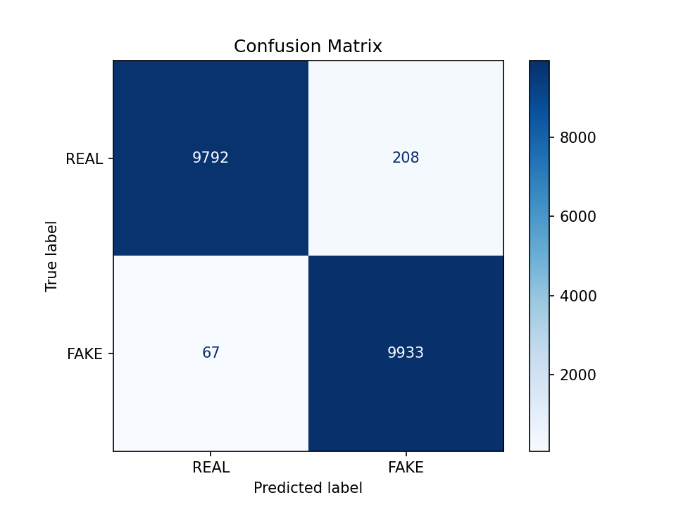
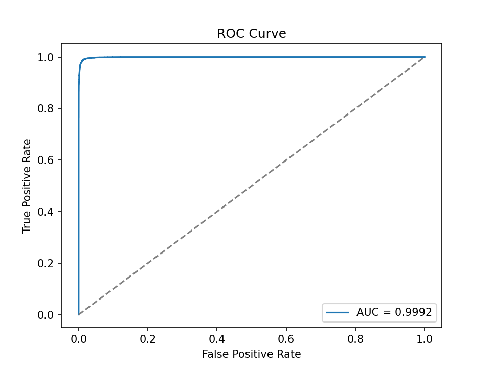
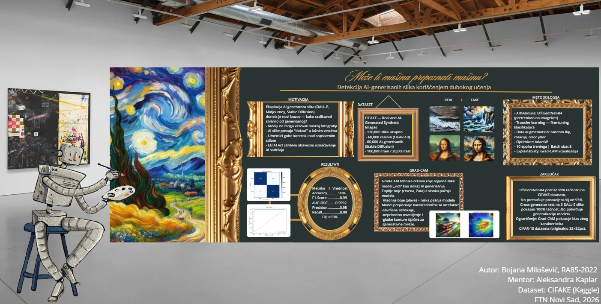

# Može li mašina prepoznati mašinu?
### Detekcija AI-generisanih slika korišćenjem dubokog učenja

<p align="center">
  
</p>

> Sistem prima sliku na ulazu i klasifikuje da li je u pitanju **AI-generisana slika** ili **realna fotografija** — koristeći transfer learning sa EfficientNet-B4 i Grad-CAM vizualizaciju.

**Autor:** Bojana Milošević, RA85-2022  
**Asistent:** Aleksandra Kaplar  
**Predmet:** Soft Computing — FTN Novi Sad, 2026

---

## Rezultati

| Metrika | Vrednost |
|---------|----------|
| **Accuracy** | **99%** |
| F1-Score | 0.99 |
| AUC-ROC | 0.9992 |
| Precision (FAKE) | 0.98 |
| Recall (FAKE) | 0.99 |

### Confusion Matrix


### ROC Kriva


---

## Dataset

**CIFAKE — Real and AI-Generated Synthetic Images** ([Kaggle](https://www.kaggle.com/datasets/birdy654/cifake-real-and-ai-generated-synthetic-images))

- 120,000 slika ukupno (60,000 realnih + 60,000 AI-generisanih)
- Realne slike iz CIFAR-10 dataseta
- AI slike generisane pomoću **Stable Diffusion**
- Podela: 100,000 train / 20,000 test

---

## Metodologija

- **Arhitektura:** EfficientNet-B4 (pretreniran na ImageNet)
- **Pristup:** Transfer learning — fine-tuning klasifikatora
- **Data augmentation:** random flip, rotacija, color jitter
- **Optimizer:** AdamW | **Epochs:** 10 | **Batch size:** 8
- **Explainability:** Grad-CAM vizualizacija

---

## Grad-CAM

Grad-CAM tehnika otkriva koje regione slike model koristi kao dokaz AI generisanja. Model prepoznaje karakteristične AI artefakte kao što su savršene refleksije, neprirodno osvetljenje i glatke konture.

---

## Cross-Generator Test

Model je treniran na Stable Diffusion slikama, a testiran na **DALL-E** slikama (auto, meda, žena) — postigao je **100% tačnost**, što potvrđuje generalizaciju modela na druge AI generatore.

---

## Pokretanje

### Instalacija
```bash
python -m venv venv
source venv/Scripts/activate  # Windows
pip install torch torchvision torchaudio --index-url https://download.pytorch.org/whl/cu118
pip install scikit-learn matplotlib numpy pillow tqdm grad-cam
```

### Trening
```bash
python src/train.py
```

### Evaluacija
```bash
python src/evaluate.py
```

### Predikcija jedne slike
```bash
python src/predict.py "putanja/do/slike.jpg"
```

### Grad-CAM vizualizacija
```bash
python src/gradcam.py
```

---

## Struktura projekta

```
ai-image-detection/
├── data/
│   ├── train/                  # 100,000 slika za trening
│   ├── test/                   # 20,000 slika za testiranje
│   └── cross_generator_test/   # DALL-E test slike
├── models/
│   └── best_model.pth          # Najbolji model (Epoch 9, 98.62%)
├── results/
│   ├── confusion_matrix.png
│   ├── roc_curve.png
│   └── gradcam_*.jpg
└── src/
    ├── dataset.py
    ├── model.py
    ├── train.py
    ├── evaluate.py
    ├── gradcam.py
    └── predict.py
```

---

## Ograničenja

- Model je treniran na CIFAR-10 slikama (originalno 32×32 px) što dovodi do mutnih vizualizacija
- Grad-CAM pokazuje bias ka uglovima slike zbog karakteristika dataseta
- Model je primarno treniran na Stable Diffusion slikama — generalizacija na Midjourney može varirati

---

## Poster

<p align="center">
  
</p>

[Pogledaj poster](poster.pdf)